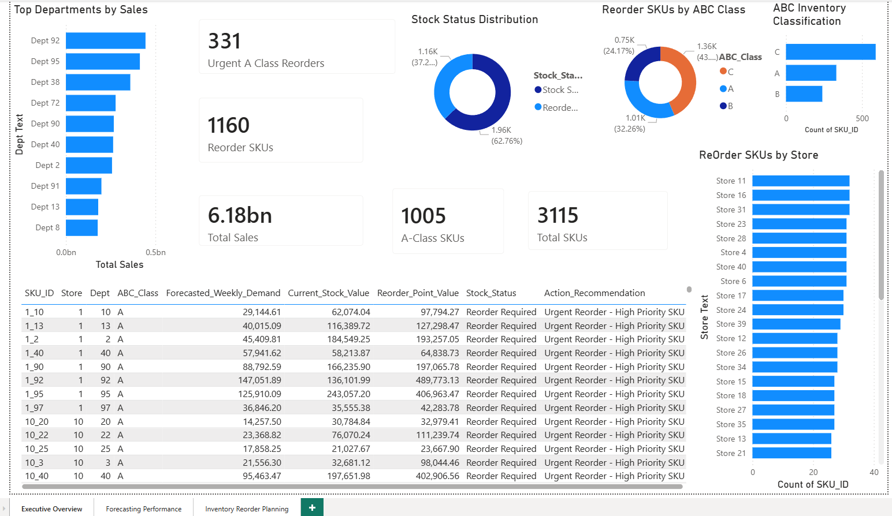
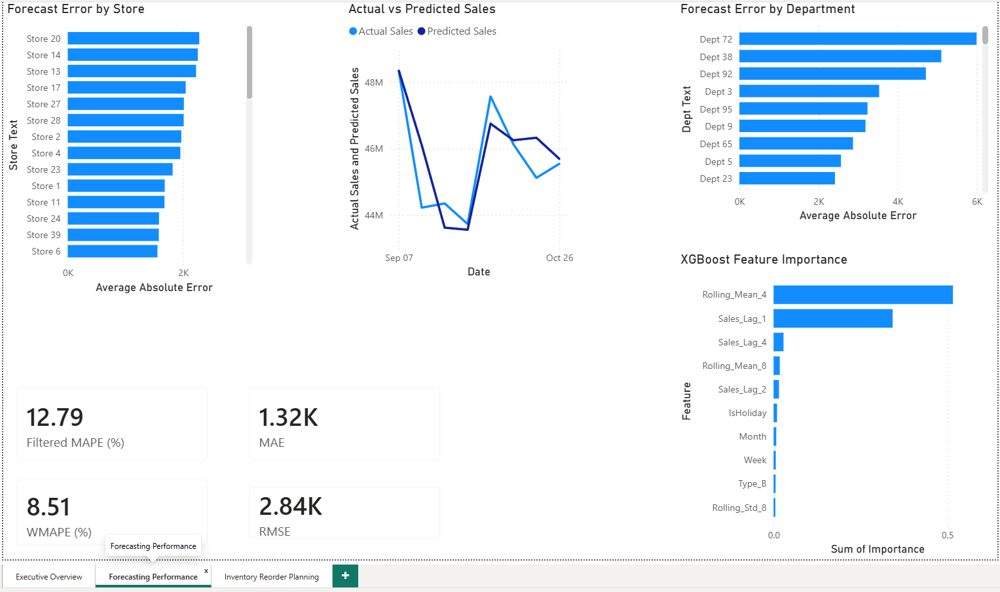
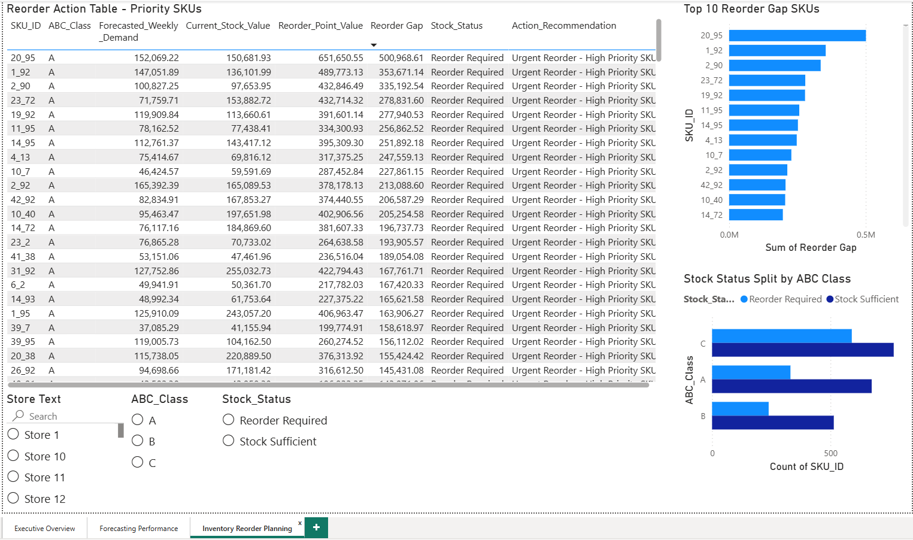

# Walmart Demand Forecasting & Inventory Reorder Planning

### An End-to-End Supply Chain Analytics Dashboard

A supply chain analytics project built using Walmart retail sales data.

This project combines **machine learning-based demand forecasting** with **inventory reorder planning**. The final output is a **Power BI dashboard** that helps identify SKUs requiring replenishment.

The objective is to forecast weekly demand at a **Store-Department level** and use that forecast to support reorder decisions.

**Dataset:** Walmart Sales Forecasting Dataset  
**Model:** XGBoost Regression  
**Dashboard:** Power BI  

---

## Business Problem

Retail businesses face two common inventory problems:

- **Stockouts** — lost sales, poor service level, and customer dissatisfaction
- **Overstocking** — blocked working capital and higher holding cost

This project creates a simple forecasting and inventory planning workflow to answer:

- Which SKUs require reorder?
- Which SKUs are high priority?
- Which stores and departments need attention?
- How accurate is the demand forecast?

---

## Project Architecture

**data/**
- train.csv
- features.csv
- stores.csv
- test.csv

**notebooks/**
- walmart_xgboost_inventory_project.ipynb

**outputs/**
- forecast_results.csv
- model_metrics.csv
- inventory_planning.csv
- feature_importance.csv

**powerbi/**
- Walmart_Demand_Forecasting_Inventory_Planning.pbix

**images/**
- executive_overview.png
- forecasting_performance.png
- inventory_reorder_planning.png

---

## Dataset Overview

The dataset contains Walmart weekly sales data along with store and external features.

| File | Description |
|---|---|
| train.csv | Historical weekly sales data |
| features.csv | Temperature, fuel price, CPI, unemployment, markdowns |
| stores.csv | Store type and store size information |
| test.csv | Original test file from the dataset |

In this project, each **Store + Department** combination is treated as one SKU/planning unit.

Example:

**Store 1 + Dept 92 = SKU_ID 1_92**

---

## Tech Stack

| Category | Tools |
|---|---|
| Programming | Python |
| Data Processing | Pandas, NumPy |
| Machine Learning | XGBoost, Scikit-learn |
| Dashboarding | Power BI |
| BI Calculations | DAX |
| Output Files | CSV, PBIX |

---

## Methodology

### 1. Data Cleaning and Preparation

The files **train.csv**, **features.csv**, and **stores.csv** were merged using common columns such as Store, Date, and IsHoliday.

Steps performed:

- Converted Date column into datetime format
- Filled missing markdown values with 0
- Removed negative weekly sales values
- Created SKU_ID using Store and Department
- Added year, month, week, and quarter features
- Converted store type into model-friendly columns

---

### 2. Feature Engineering

Demand forecasting depends strongly on past sales behavior. To capture this, lag and rolling features were created.

**Lag Features**

| Feature | Meaning |
|---|---|
| Sales_Lag_1 | Sales from previous week |
| Sales_Lag_2 | Sales from 2 weeks ago |
| Sales_Lag_4 | Sales from 4 weeks ago |
| Sales_Lag_8 | Sales from 8 weeks ago |
| Sales_Lag_12 | Sales from 12 weeks ago |

**Rolling Features**

| Feature | Meaning |
|---|---|
| Rolling_Mean_4 | Average sales of previous 4 weeks |
| Rolling_Mean_8 | Average sales of previous 8 weeks |
| Rolling_Std_4 | Demand variation over previous 4 weeks |
| Rolling_Std_8 | Demand variation over previous 8 weeks |

These features helped the model capture recent demand trends and sales volatility.

---

### 3. Demand Forecasting Model

An **XGBoost Regression** model was trained to predict weekly sales.

A time-based split was used:

| Split | Data Used |
|---|---|
| Training Data | Older historical weeks |
| Testing Data | Most recent 8 weeks |

A random split was avoided because forecasting should be tested on future unseen periods.

---

## Model Performance

The model was evaluated on the final 8-week validation period.

| Metric | Value |
|---|---:|
| MAE | 1316.18 |
| RMSE | 2841.65 |
| Filtered MAPE | 12.79% |
| **WMAPE** | **8.51%** |

**WMAPE** was used as the main metric because raw MAPE was distorted by very low-sales departments.

---

## Feature Importance

The top model features were:

| Rank | Feature |
|---:|---|
| 1 | Rolling_Mean_4 |
| 2 | Sales_Lag_1 |
| 3 | Sales_Lag_4 |
| 4 | Rolling_Mean_8 |
| 5 | Sales_Lag_2 |

This shows that recent sales history had the strongest impact on the forecast.

---

## Inventory Reorder Planning

After forecasting weekly demand, the forecast output was used for inventory planning.

The Walmart dataset does not contain actual inventory levels or supplier lead times. Because of that, **current stock** and **lead time** were simulated only for the inventory planning layer.

The forecasting model itself was trained on real historical Walmart sales data.

---

## Inventory Logic Used

### Safety Stock

Safety Stock = 1.65 × Demand Standard Deviation × √Lead Time

### Reorder Point

Reorder Point = Forecasted Weekly Demand × Lead Time + Safety Stock

### Stock Status

If Current Stock is less than Reorder Point, the SKU is marked as **Reorder Required**.  
Otherwise, it is marked as **Stock Sufficient**.

---

## ABC Inventory Classification

ABC analysis was performed based on total sales contribution.

| ABC Class | Meaning | Priority |
|---|---|---|
| A | High-value SKUs | High |
| B | Medium-value SKUs | Medium |
| C | Low-value SKUs | Low |

A-class SKUs were treated as the most important when reorder action was required.

---

## Power BI Dashboard

The final Power BI dashboard contains three pages.

---

### Page 1 — Executive Overview

This page gives a high-level summary of sales and inventory status.

Main visuals:

- Total Sales
- Total SKUs
- SKUs Requiring Reorder
- A-Class SKUs
- Urgent A-Class Reorders
- Stock Status Distribution
- ABC Inventory Classification
- Top Departments by Sales
- Reorder SKUs by Store
- Priority SKU Table

---

### Page 2 — Forecasting Performance

This page focuses on model accuracy and forecast behavior.

Main visuals:

- MAE
- RMSE
- Filtered MAPE
- WMAPE
- Actual vs Predicted Sales
- Forecast Error by Store
- Forecast Error by Department
- XGBoost Feature Importance

---

### Page 3 — Inventory Reorder Planning

This page focuses on replenishment decisions.

Main visuals:

- Top 10 Reorder Gap SKUs
- Stock Status Split by ABC Class
- Reorder Action Table
- Store Slicer
- ABC Class Slicer
- Stock Status Slicer

---

## Key Findings

1. **XGBoost achieved 8.51% WMAPE** on the validation period.
2. **Rolling_Mean_4** and **Sales_Lag_1** were the strongest forecasting features.
3. **1160 out of 3115 SKUs** were flagged as requiring reorder.
4. **1005 SKUs** were classified as A-class SKUs.
5. **331 A-class SKUs** required urgent reorder action.
6. Departments like **Dept 92** and **Dept 95** contributed strongly to total sales.
7. The dashboard helps convert forecast output into clear inventory actions.

---

## Output Files

| File | Description |
|---|---|
| forecast_results.csv | Actual vs predicted sales for validation period |
| model_metrics.csv | Forecasting accuracy metrics |
| inventory_planning.csv | Safety stock, reorder point, stock status, ABC class |
| feature_importance.csv | XGBoost feature importance values |
| Walmart_Demand_Forecasting_Inventory_Planning.pbix | Final Power BI dashboard |

---

## Assumptions

- Weekly sales were used as a proxy for demand.
- Actual stock levels were not available in the dataset.
- Supplier lead times were simulated.
- Current stock values were simulated.
- The model predicts sales value, not physical unit quantity.

These assumptions were made because the original dataset is mainly a sales forecasting dataset, not a complete inventory management dataset.

---

## Limitations

- No real inventory quantity data
- No supplier-level lead time data
- No actual purchase order history
- No product-level cost data
- Reorder quantity optimization was not included in this version

---

## Future Improvements

- Add real inventory and supplier lead time data
- Add EOQ-based order quantity calculation
- Compare XGBoost with LightGBM, Prophet, or ARIMA
- Add SQL database integration
- Add supplier performance analysis
- Publish the dashboard using Power BI Service
- Automate refresh pipeline

---

## Project Summary

This project connects **demand forecasting** with **inventory reorder planning**.

Instead of stopping at prediction, the forecasted demand was used to calculate:

- Safety Stock
- Reorder Point
- Stock Status
- Reorder Gap
- ABC Priority
- Action Recommendation

The final Power BI dashboard gives a practical view of which SKUs need attention and which reorder cases should be handled first.
